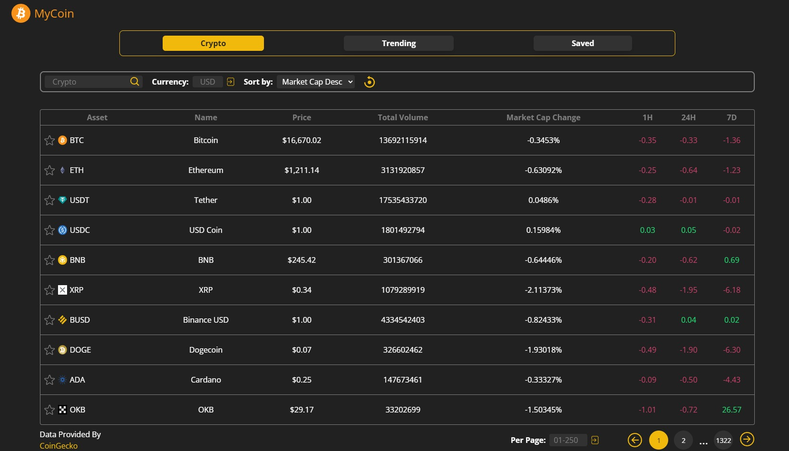
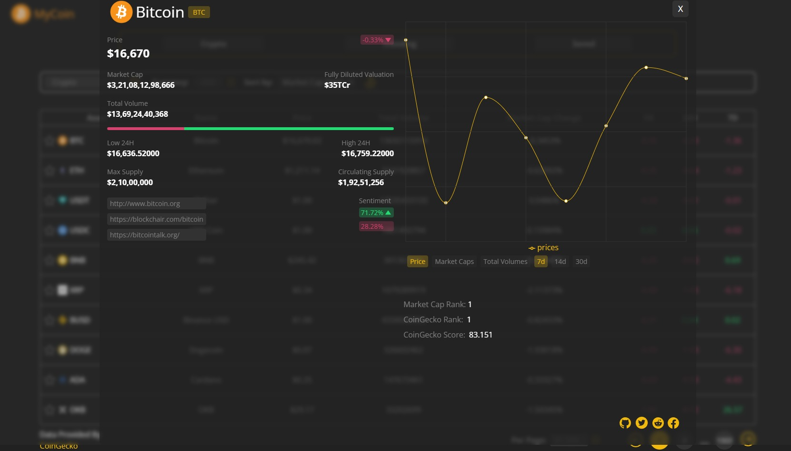
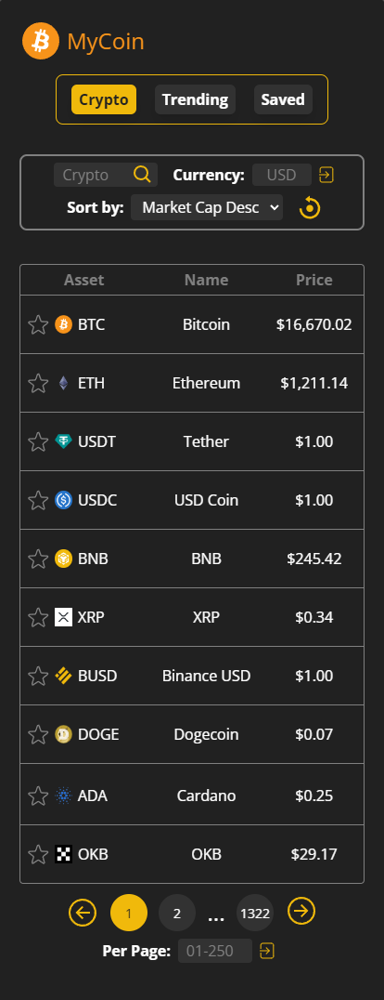
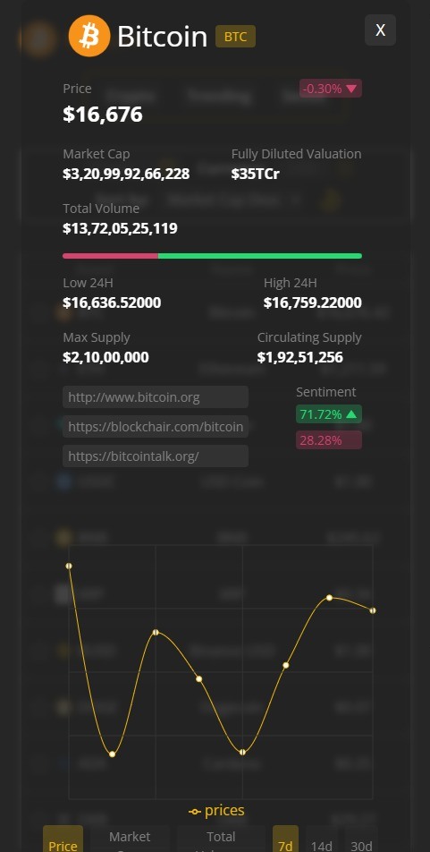

# Welcome to MyCoin 👋

> My Coin is a powerful and user-friendly cryptocurrency web app that allows you to track the latest prices, charts, and market cap for your favorite coins. Built using the latest technologies such as React, Tailwind CSS, and Recharts, My Coin delivers a seamless and visually appealing experience for all users.
>  With real-time data from the coingecko API, you can stay up-to-date on the latest market movements and make informed decisions about your portfolio. Whether you're a seasoned crypto trader or just starting out, My Coin has the features and functionality you need to succeed in the world of cryptocurrency.

### ✨ [Demo](https://my-coin.netlify.app/)

 
 

### Project Images

 

## Author

👤 **Marcelo Petry**

- Website: http://marcelopetry.com/
- Github: [@m-Petry](https://github.com/m-Petry)
- LinkedIn: [@https:\/\/www.linkedin.com\/in\/m-petry\/](https://linkedin.com/in/https://www.linkedin.com/in/m-petry/)

## Show your support

Give a ⭐️ if this project helped you!

---
